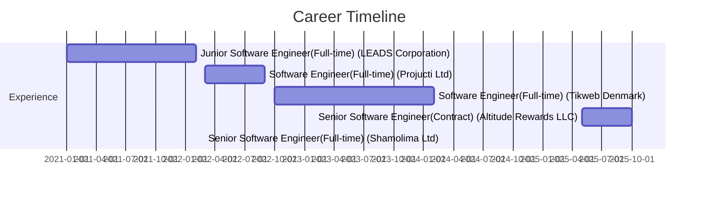

<div align="center">

# 👋 Sirajul Islam Sojib

### Senior Software Engineer | Mobile Application Architect

[](https://linkedin.com/in/imsisojib)
[](mailto:imsisojib@gmail.com)
[](https://github.com/imsisojib)
[](tel:+8801521315259)

</div>

---

## 🚀 Quick Stats

<table>
<tr>
<td width="50%">

```yaml
Experience: 5+ Years
Specialization: Flutter & Native Android
Apps Deployed: 15+
Total Users: 500K+
Performance Boost: ⬆️ 60%
Code Quality: ⬆️ 40%
```

</td>
<td width="50%">

```yaml
Leadership:
  - Led 5+ Development Teams
  - Mentored 10+ Developers
  - International Clients
  - Agile/Scrum Expert
```

</td>
</tr>
</table>

---

## 🛠️ Tech Stack

<div align="center">

### Mobile Development


### Architecture & State Management


### Backend & Cloud


### DevOps & Tools


</div>

---

## 🌟 Featured Projects

<table>
<tr>
<td width="50%">

### 📦 ECOFLIT
**Supply Chain & Logistics**

🏢 Shamolima Ltd  
🔧 Flutter • BLoC • Firebase

✅ Offline-first architecture  
✅ Real-time GPS tracking  
✅ Role-based access control

[](https://play.google.com/store/apps/details?id=snz.ecoflit)
[](https://apps.apple.com/us/app/ecoflit/id6737822726)

</td>
<td width="50%">

### 🎨 MUSEIQ
**Artist Empowerment Platform**

🏢 Tikweb (Denmark)  
🔧 Flutter • Clean Architecture

✅ 60% faster startup  
✅ 40% smaller app size  
✅ International platform

[](https://play.google.com/store/apps/details?id=com.museiq.app)
[](https://apps.apple.com/app/id1662343741)

</td>
</tr>

<tr>
<td width="50%">

### 🚗 AutoHubAI
**Auto Shop Management**

🏢 LiberateLab LLC  
🔧 Flutter • BLoC • Firebase

✅ Business automation  
✅ Real-time analytics  
✅ Performance tracking

[](https://play.google.com/store/apps/details?id=com.shopai.autohubai&hl=en)
[](https://apps.apple.com/us/app/autohubai/id6737810037)

</td>
<td width="50%">

### 🛒 Star Tech
**E-Commerce Platform**

🏢 Projucti Ltd  
🔧 Flutter • GetX • Payment

✅ 100K+ users  
✅ 10K+ products  
✅ Payment integration

[](https://play.google.com/store/apps/details?id=com.startech.shop)
[](https://apps.apple.com/app/id6443544088)

</td>
</tr>

<tr>
<td width="50%">

### 😴 SleepGofer
**Sleep Tracking & Analysis**

🏢 Freelance  
🔧 Flutter • Audio Processing

✅ Real-time detection  
✅ Pattern analysis  
✅ Statistics dashboard

[](https://play.google.com/store/apps/details?id=com.sleepgofer.sleep_gofer&hl=en)
[](https://apps.apple.com/us/app/sleepgofer/id6740777770)

</td>
<td width="50%">

### 💄 Floramom
**Skincare E-Commerce**

🏢 Freelance  
🔧 Flutter • GetX • Payment

✅ International brands  
✅ Smart filtering  
✅ Secure checkout

[](https://play.google.com/store/apps/details?id=com.floramom.app&hl=en)

</td>
</tr>

<tr>
<td width="50%">

### 🏦 RAKUB eBanking
**Mobile Banking**

🏢 LEADS Corporation  
🔧 Kotlin • MVVM • Security

✅ Biometric auth  
✅ SSL pinning  
✅ 95%+ crash-free

[](https://play.google.com/store/apps/details?id=com.rakub.mobile)

</td>
<td width="50%">

### 🛍️ Public Market
**C2C Marketplace**

🏢 Freelance  
🔧 Flutter • Provider • Maps

✅ Job postings  
✅ Location-based  
✅ Secure messaging

[](https://play.google.com/store/apps/details?id=com.BD.publicmarket.app)
[](https://apps.apple.com/us/app/public-market-buy-sell-job/id1637868355)

</td>
</tr>
</table>

---

## 📊 GitHub Stats

<div align="center">


</div>

---

## 💼 Professional Journey



---

## 🎯 What I Offer

<table>
<tr>
<td width="33%" align="center">

### 💻 Technical Excellence
Clean Architecture  
Performance Optimization  
Scalable Solutions  
Security Best Practices

</td>
<td width="33%" align="center">

### 👥 Leadership
Team Management  
Code Reviews  
Mentorship  
Agile/Scrum

</td>
<td width="33%" align="center">

### 🚀 Delivery
On-Time Projects  
Quality Assurance  
CI/CD Implementation  
Client Satisfaction

</td>
</tr>
</table>

---

## 🎓 Education

**BSc in Computer Science and Engineering**  
🎓 International Islamic University Chittagong | CGPA: **3.83/4.00** | 2016-2020

---

<div align="center">

## 📫 Let's Connect!

### Open for Full-Time Opportunities & Exciting Projects

[](https://linkedin.com/in/imsisojib)
[](mailto:imsisojib@gmail.com)
[](https://wa.me/8801521315259)

---

⭐️ **Dhaka, Bangladesh** • **Available for Remote Work**

*Building exceptional mobile experiences, one app at a time* 🚀

</div>
